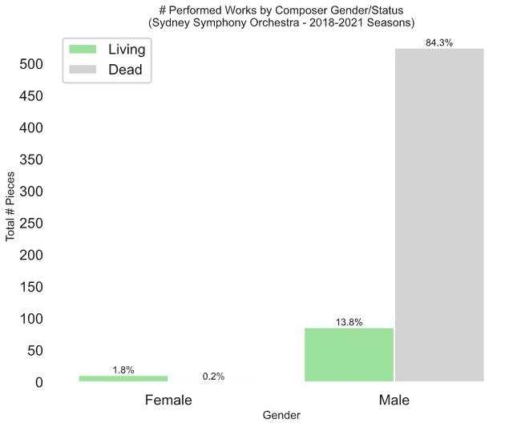
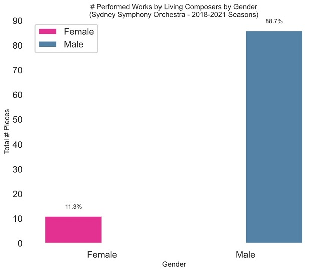
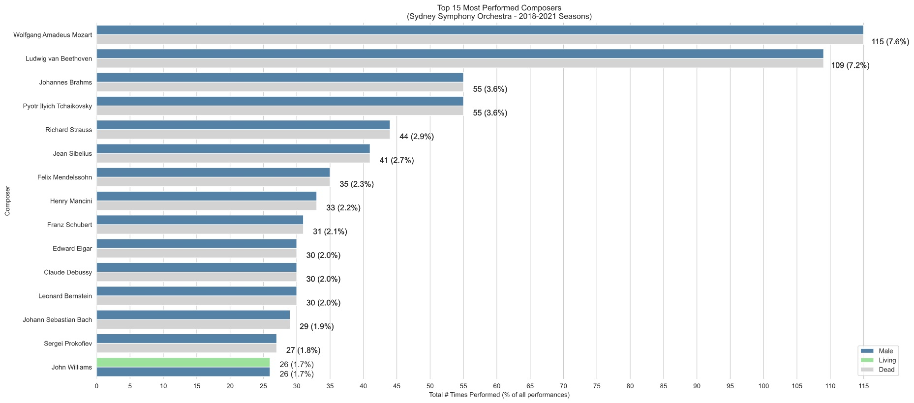
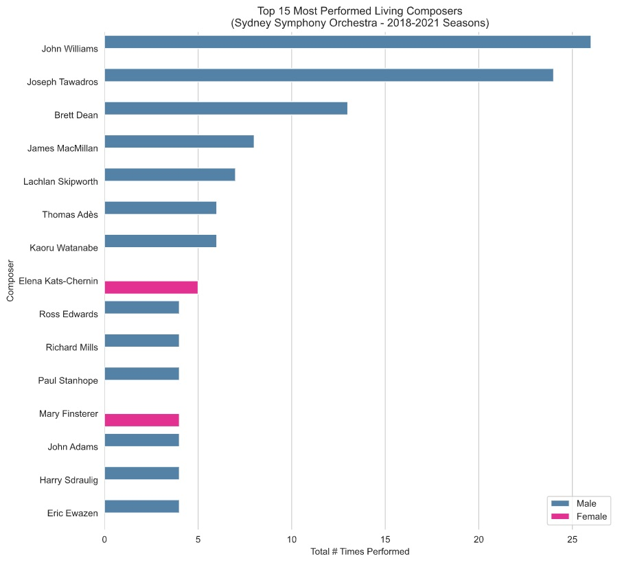

# Composer diversity in Sydney Symphony Orchestra season programming: 2018-2021

## Table of Contents
1. [Overview](#overview)
2. [Background](#background)
3. [2020 Disclaimer](#2020disclaimer)
4. [Data](#data)
5. [Results](#results)
6. [Final thoughts](#finalthoughts)

## OVERVIEW 

This project examines the Sydney Symphony Orchestra's (SSO) trend in composer diversity over the 2018-2021 seasons.  It specifically quantifies and analyses the diversity of programmed works according to composer gender, nationality and animate status (living/dead).

Current analysis for the 2018-2021 seasons:
* overall:
  * **2%** of performed works are by **female composers** 
  * **91%** of performed works are by **European** and **North American composers**
  * **16%** of performed works are by **living composers**
* top 15 most performed composers:
  * **top 15 most performed composers**:
    * are **largely deceased (93%)** and **male (100%)**
    * are all **European (80%)** and **North American (20%)**
  * **top 15 most performed *living* composers**
    * are **more diverse** both in gender and nationality
    * **60%** are **Australian**, the remainder are North American and British
    * **13%** are **female**
* however:
  * **70%** of female composers in the data set are **Australian** and **living**
  * the other living female composers are from New Zealand and the UK

**Summary**: The SSO's commitment to programming Australian composers is bearing results, particularly with regard to female composers.  However, the SSO's overall programming diversity is still noticeably imbalanced in favour of works by deceased European and North American male composers.

(***Note**: No composer [or conductor] in the current data set has publicly identified as any gender other than male or female, so for now, only **male** and **female** values are used.  This could change in future*).

## BACKGROUND 

This project was originally inspired by a Baltimore Symphony Orchestra analysis of trends in composer, conductor and instrumental soloist diversity across 85 American symphony orchestras during the 2016-2017 season: https://www.bsomusic.org/stories/the-data-behind-the-2016-2017-orchestra-season/

I wrote the initial data aggregation and analysis code in late 2019, but then updated the code again in late 2020 to incorporate 2021 season program data.

Note that the current iteration of the project is narrowly focused, but future iterations (depending on time and resources, of course) could broaden to look at programming by other major Australian orchestras.  They could also examine conductor and guest artist diversity

## 2020 DISCLAIMER 

Most 2020 season concerts from March onwards were cancelled because 2020.  However, I have quantified and analysed the data as if the concerts had gone ahead anyway, with the assumption that the original 2020 schedule reflects the programming that the SSO would have wished to present in a year *sans plague*.

## DATA 

All data was aggregated from publicly available sources ([SSO website](https://www.sydneysymphony.com), [Wikipedia](https://en.wikipedia.org), [Wikidata](https://query.wikidata.org)).

For a *detailed* explanation of the data acquisition and preparation process and its attendant challenges, please refer to [**DATA NOTES**](DATA_NOTES.md).

-----

## RESULTS 

### OVERALL 2018-2021 STATISTICS

||unique_concerts|total_performances|unique_works_performed|total_composers
--|--|--|--|--
2018|78|459|227|97
2019|76|484|216|116
2020|46|325|125|63
2021|36|240|92|53
**TOTAL**|**236**|**1508**|**625**|**207**

|Composer Status|# Pieces|% Pieces
--|-|--
Dead|526|84%
Living|99|16%

|Composer Region|# Pieces|% Pieces
--|--|--
Europe|491|79%
North America|77|12%
Oceania|45|7%
South America|8|1%
Asia|4|1%

### # PERFORMED WORKS
#### BY COMPOSER GENDER/STATUS

**Male** composers wrote **98%** of all performed works. 
**Female** composers wrote **2%** of all performed works:

#### BY LIVING COMPOSERS

**Male** composers wrote **89%** of performed works by **living** composers. 
**Female** composers wrote **11%** of performed works by **living** composers:

### TOP 15 MOST PERFORMED COMPOSERS

The top 15 most performed composers:
* account for:
  * **41%** of total unique works performed
  * **45%** of total performances
* are largely **deceased, male European and North American** composers
  * John Williams (American, living) is the only partial exception to this rule

  

### TOP 15 MOST PERFORMED **LIVING** COMPOSERS

The top 15 most performed **living** composers:
* are slightly more diverse overall, and 60% Australian
* include:
  * 2 Australian women
  * a mix of Australian (9), North American (4), and UK (2) composers

  

### TODO

* Add some baseline comparative stats from https://donne-uk.org/2019-2020/ and https://www.bsomusic.org/stories/the-data-behind-the-2016-2017-orchestra-season/
* Better graphs?
* Add more stats/graphs with:
  * breakdown by nationality
  * breakdown by gender/nationality per season
  * breakdown by animate status/nationality per season

----

## FINAL THOUGHTS 

In no particular order:

* For the curious: This project, which grew out of previous data science coursework, exists primarily because I wanted to work on a fun data project related to a subject (the arts) that I'm interested in.  (Although it ended up requiring *slightly* more effort than anticipated. :)

* While the data analysis does admittedly point in a particular direction (i.e. a tendency by classical symphony orchestras to program lots of works by deceased, white male European and North American composers), I would underline that this characteristic actually still applies to most organisations in the field.  In this regard, the SSO is fairly typical.  With that said, many orchestras, including the SSO, recognise the need for greater diversity and representation and have recently embarked on [various initiatives](https://www.sydneysymphony.com/support-us/donate/50-fanfares) to program more women composers, composers of colour, indigenous and regional composers, and so forth.  Change is coming, slowly but surely.

* Another positive change for the new era: [SSO Chief Conductor Designate Simone Young](https://www.sydneysymphony.com/musicians/simone-young) officially assumes her post in 2022.
  * (PS. If anyone from the SSO admin side happens to read this, please also consider bringing Maestras Xian Zhang and Nathalie Stutzmann to Sydney as guest conductors [again], thank you very much!)

----

## Built With

* [BeautifulSoup](https://www.crummy.com/software/BeautifulSoup/)
* [matplotlib](https://matplotlib.org)
* [mwparserfromhell](https://mwparserfromhell.readthedocs.io)
* [numpy](https://numpy.org)
* [pandas](https://pandas.pydata.org)
* [pydantic](https://github.com/samuelcolvin/pydantic)
* [qwikdata](https://qwikidata.readthedocs.io/en/stable/readme.html)
* [seaborn](https://seaborn.pydata.org)
* [SQLAlchemy](https://www.sqlalchemy.org)
* [unidecode](https://pypi.org/project/Unidecode/)
* Fervent wishes for a New Grove Dictionary of Music API or its open source equivalent
  * (No, this will never happen)

## Authors

* https://github.com/ey-tsifry